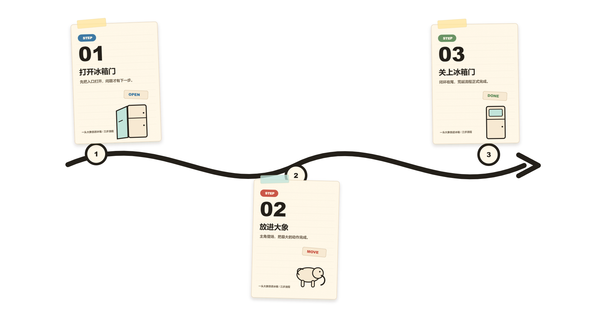

# nook-card

`nook-card` is a reusable Codex/OpenDesign skill for producing knowledge cards and optional Remotion-ready motion handoff specs.

It is designed for an interactive workflow: choose a card style, confirm card count and copy structure, generate static card assets, then optionally continue into transparent-background video output.

## Gallery

These examples were generated while validating the first `nook-card` workflow.

| Static card | Motion composition preview |
| --- | --- |
|  |  |
|  |  |

## What It Does

- Produces structured knowledge-card specs for OpenDesign-compatible rendering.
- Keeps style systems reusable through `references/style-registry.md` and `references/styles/`.
- Separates `transparent_asset` from `preview_composite`, so cards can be used cleanly in Remotion, Premiere Pro, Final Cut Pro, DaVinci Resolve, or later layout composition.
- Keeps video/stage canvas separate from card asset ratio. A landscape `1920 x 1080` video can still use portrait `3:4` cards.
- Provides motion presets and Remotion handoff rules for alpha-channel video delivery.

## Install

Clone this repository, then install the skill folder into your local skills directory.

For Codex:

```bash
cp -R nook-card ~/.codex/skills/nook-card
```

On Windows, copy the `nook-card` folder into your Codex skills directory, for example:

```powershell
Copy-Item -Recurse .\nook-card "$env:USERPROFILE\.codex\skills\nook-card"
```

For OpenDesign, import or copy the `nook-card` folder through the OpenDesign skills workflow. The skill is intentionally self-contained: `SKILL.md` is the entry point, `DESIGN.md` is the default design-system summary, and `references/` contains the workflow, style, motion, and handoff specs.

## Basic Workflow

1. Trigger `nook-card` with a card topic or source note.
2. Confirm production intent: static-only, motion-ready assets, or static plus motion video.
3. Confirm card style, card count, split method, card asset ratio, and output layers.
4. Generate static card assets.
5. If needed, confirm motion preset and render a transparent-background video.

The skill should ask step-by-step choice questions instead of broad open-ended questions.

## Included Styles

- `tactile_soft_skeuomorphic_card` default: thick black stroke, hard shadow, near-white dotted surface, high-saturation action colors.
- `glassmorphism_layered_card`: translucent frosted panels, soft depth, luminous borders.
- `pop_art_comic_card`: saturated comic colors, halftone texture, bold outlines.
- `analog_journal_collage_card`: paper, tape, sticker, margin-note, and notebook metaphors.

Add new reusable styles in `nook-card/references/style-registry.md` and place detailed specs in `nook-card/references/styles/`.

## Included Motion Presets

- `pop_breathe` default: cards pop from below, center, then keep a subtle breathing hold.
- `timeline_arrow_reveal`: path or arrow grows, then cards reveal step by step.
- `portrait_carousel_focus`: vertical card carousel with a sharp focused front card.
- `dynamic_compare_bars`: animated comparison bars for data or ranking stories.

Add new reusable motion presets in `nook-card/references/motion-registry.md`.

## Outputs

By convention, generated assets should be written under the current project workspace:

```text
outputs/cards/<slug>/
outputs/videos/<slug>/
```

Do not bake preview backgrounds into motion-ready card assets. Use:

- `transparent_asset` for card-only transparent assets.
- `preview_composite` for human review renders with a background.
- `remotion-handoff.json` for video handoff.

## Repository Hygiene

This repository is prepared to publish only the reusable skill and public documentation. Generated outputs, local Remotion experiments, dependency folders, private environment files, and machine-specific notes are ignored by `.gitignore`.
