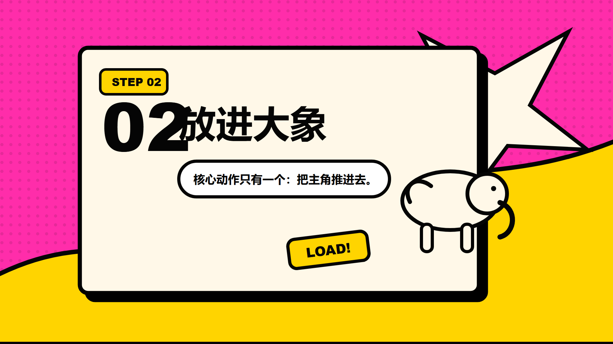

# nook-card

**Language:** [中文](#中文) / [English](#english)

`nook-card` is a reusable Codex/OpenDesign skill for producing knowledge cards and optional Remotion-ready motion handoff specs.

## Gallery

These examples were generated while validating the first `nook-card` workflow.

| Static card | Motion composition preview |
| --- | --- |
|  |  |
|  |  |

## 中文

### 这是什么

`nook-card` 是一套用于制作知识卡片的本地 skill。它的目标不是做一次性的海报，而是沉淀一套可复用流程：

1. 先和你确认卡片用途、风格、卡片数量、拆卡方式、横竖画幅、文案层级。
2. 再驱动 OpenDesign 生成静态卡片资产。
3. 如果你需要视频，再把卡片交给 Remotion 做透明背景动效视频。

它特别强调两件事：

- 静态卡片和动效视频是两个阶段，可以只做静态卡，也可以继续进入视频。
- `transparent_asset` 和 `preview_composite` 必须分开。前者用于 Remotion/剪辑软件合成，后者用于人眼预览。

### 相关项目

这个 skill 站在两个优秀开源项目的肩膀上：

- OpenDesign: [nexu-io/open-design](https://github.com/nexu-io/open-design)
- Remotion: [remotion-dev/remotion](https://github.com/remotion-dev/remotion)

感谢 OpenDesign 原作者、维护者和贡献者提供本地优先的设计生成工作流；感谢 Remotion 团队和贡献者让 React/CSS/SVG/Canvas 能成为可编程视频生产工具。本仓库只是围绕知识卡片场景整理的一套 skill 配方，不隶属于上述项目。

### 下载方式

你可以用两种方式下载。

方式 A：直接下载 ZIP

1. 打开 GitHub 仓库页面。
2. 点击绿色 `Code` 按钮。
3. 选择 `Download ZIP`。
4. 解压后找到里面的 `nook-card/` 文件夹。

方式 B：使用 Git

```bash
git clone https://github.com/captain-nook/nook-card.git
cd nook-card
```

### 安装到 Codex

把仓库里的 `nook-card/` 文件夹复制到你的 Codex skills 目录。

macOS / Linux:

```bash
mkdir -p ~/.codex/skills
cp -R nook-card ~/.codex/skills/nook-card
```

Windows PowerShell:

```powershell
New-Item -ItemType Directory -Force "$env:USERPROFILE\.codex\skills" | Out-Null
Copy-Item -Recurse .\nook-card "$env:USERPROFILE\.codex\skills\nook-card"
```

重启 Codex 后，输入类似下面的话即可触发：

```text
使用 nook-card，帮我做一组关于 PARA 文件分类方法的知识卡片。
```

### 安装到 OpenDesign

先安装 OpenDesign。请以 OpenDesign 官方说明为准：

- GitHub: [nexu-io/open-design](https://github.com/nexu-io/open-design)
- Website: [open-design.ai](https://open-design.ai/)
- Skills docs: [opendesigner.io/skills](https://opendesigner.io/skills)

安装 OpenDesign 后，把 `nook-card/` 导入或复制到 OpenDesign 的 skills 目录。不同系统和版本的本地目录可能不同，建议优先使用 OpenDesign 应用里的 skills 管理入口；如果你的版本要求手动复制，请按 OpenDesign 官方文档指定的位置放置。

导入后，在 OpenDesign 的 skills 列表里搜索：

```text
nook-card
```

### 使用教程

推荐的第一次测试流程：

1. 在 Codex 中输入：`使用 nook-card，做一组“大象放进冰箱三步”的卡片。`
2. 按照 Codex 的选择题确认：静态卡还是动效、卡片风格、卡片数量、卡片比例、是否需要透明资产。
3. 先生成静态卡片，检查文字、风格和构图。
4. 如果满意，再选择是否进入 Remotion 动效阶段。
5. 如果进入动效阶段，默认建议输出 MOV / ProRes 4444 / alpha，方便导入 Premiere Pro、Final Cut Pro、DaVinci Resolve 等剪辑软件。

### 默认流程

触发 `nook-card` 后，Codex 应该按选择题逐步确认：

1. 生产意图：只做静态卡，还是后续要进入动效？
2. 舞台画幅：默认横屏 `1920 x 1080`，可选竖屏 `1080 x 1920`。
3. 卡片风格：默认 `tactile_soft_skeuomorphic_card`。
4. 卡片数量和拆卡方式：步骤、分类、清单、章节都应该先拆卡。
5. 卡片自身比例：它可以和视频画幅不同，例如横屏视频里使用 `3:4` 竖卡。
6. 输出层级：`transparent_asset`、`preview_composite` 或两者都要。
7. 是否进入动效：静态卡确认后再问，不提前混在一起。

### 已包含的卡片风格

- `tactile_soft_skeuomorphic_card`: 默认风格，粗黑描边、硬阴影、近白点阵底、强行动色。
- `glassmorphism_layered_card`: 毛玻璃层叠、透明面板、柔和景深。
- `pop_art_comic_card`: 波普漫画、高饱和配色、半调网点、粗黑轮廓。
- `analog_journal_collage_card`: 手账拼贴、纸张、胶带、贴纸、注释感。

新增风格时，更新：

```text
nook-card/references/style-registry.md
nook-card/references/styles/
```

### 已包含的动效预设

- `pop_breathe`: 默认动效，从下方弹出、居中、轻微呼吸。
- `timeline_arrow_reveal`: 时间线/箭头逐步展开。
- `portrait_carousel_focus`: 竖卡走马灯聚焦。
- `dynamic_compare_bars`: 动态对比柱状图。

新增动效时，更新：

```text
nook-card/references/motion-registry.md
```

### 输出约定

生成结果建议放在当前项目工作区：

```text
outputs/cards/<slug>/
outputs/videos/<slug>/
```

核心输出类型：

- `transparent_asset`: 透明外背景卡片资产，用于 Remotion 或剪辑软件合成。
- `preview_composite`: 带背景预览图，用于检查风格和可读性。
- `card-spec.json`: OpenDesign 静态卡片中间协议。
- `remotion-handoff.json`: Remotion 视频交接协议。

### Remotion 部署说明

`nook-card` 本身不内置完整 Remotion 工程。它负责定义卡片资产和视频交接规则。真正渲染视频时，你需要在自己的项目里安装 Remotion：

```bash
npx create-video@latest
```

或者在已有 React/Remotion 项目中安装 Remotion 依赖，并读取 `remotion-handoff.json` 和透明 PNG/SVG 卡片资产。Remotion 官方仓库和文档见：

- GitHub: [remotion-dev/remotion](https://github.com/remotion-dev/remotion)
- Docs: [remotion.dev/docs](https://www.remotion.dev/docs)

## English

### What Is This

`nook-card` is a local skill for creating reusable knowledge cards. It is built for a staged workflow:

1. Confirm card purpose, style, card count, split logic, canvas orientation, and copy hierarchy.
2. Use OpenDesign to generate static card assets.
3. Optionally pass the confirmed card assets to Remotion for transparent-background motion videos.

The important idea: static cards and motion videos are separate stages. You can stop after static cards, or continue into video production.

### Related Projects

This skill is built around two open-source projects:

- OpenDesign: [nexu-io/open-design](https://github.com/nexu-io/open-design)
- Remotion: [remotion-dev/remotion](https://github.com/remotion-dev/remotion)

Thanks to the OpenDesign authors, maintainers, and contributors for the local-first design generation workflow. Thanks to the Remotion team and contributors for making React/CSS/SVG/Canvas usable for programmable video production. This repository is a knowledge-card skill recipe and is not affiliated with either project.

### Download

Option A: Download ZIP

1. Open the GitHub repository.
2. Click the green `Code` button.
3. Choose `Download ZIP`.
4. Unzip it and find the `nook-card/` folder.

Option B: Use Git

```bash
git clone https://github.com/captain-nook/nook-card.git
cd nook-card
```

### Install For Codex

Copy the `nook-card/` folder into your Codex skills directory.

macOS / Linux:

```bash
mkdir -p ~/.codex/skills
cp -R nook-card ~/.codex/skills/nook-card
```

Windows PowerShell:

```powershell
New-Item -ItemType Directory -Force "$env:USERPROFILE\.codex\skills" | Out-Null
Copy-Item -Recurse .\nook-card "$env:USERPROFILE\.codex\skills\nook-card"
```

Restart Codex and try:

```text
Use nook-card to create a knowledge-card series about the PARA file organization method.
```

### Install For OpenDesign

Install OpenDesign first, following the official project:

- GitHub: [nexu-io/open-design](https://github.com/nexu-io/open-design)
- Website: [open-design.ai](https://open-design.ai/)
- Skills docs: [opendesigner.io/skills](https://opendesigner.io/skills)

Then import or copy the `nook-card/` folder into OpenDesign's skills directory. The exact local path may differ by operating system and OpenDesign version, so prefer the skills manager inside OpenDesign when available.

Search for:

```text
nook-card
```

### First Test

1. Ask Codex: `Use nook-card to make a three-step card set: put an elephant into a fridge.`
2. Answer the step-by-step choices: static or motion, style, card count, card ratio, transparent asset needs.
3. Generate and review the static cards first.
4. If the cards look right, continue into the Remotion motion stage.
5. For editing software, prefer MOV / ProRes 4444 / alpha.

### Included Styles

- `tactile_soft_skeuomorphic_card`: default, thick black stroke, hard shadow, near-white dotted surface, strong action colors.
- `glassmorphism_layered_card`: frosted glass, translucent panels, soft depth.
- `pop_art_comic_card`: saturated comic colors, halftone texture, bold outlines.
- `analog_journal_collage_card`: paper, tape, stickers, notes, journal collage.

### Included Motion Presets

- `pop_breathe`: default, bottom pop-in, centered hold, subtle breathing.
- `timeline_arrow_reveal`: timeline or arrow reveal.
- `portrait_carousel_focus`: vertical card carousel with a focused front card.
- `dynamic_compare_bars`: animated comparison bars.

### Output Convention

Generated assets should stay under the current project workspace:

```text
outputs/cards/<slug>/
outputs/videos/<slug>/
```

Key output types:

- `transparent_asset`: card-only transparent asset for Remotion or video editors.
- `preview_composite`: review image with a background.
- `card-spec.json`: static-card handoff spec.
- `remotion-handoff.json`: motion-video handoff spec.

### Remotion Setup

`nook-card` does not bundle a full Remotion project. It defines card assets and video handoff rules. To render videos, create or use a Remotion project:

```bash
npx create-video@latest
```

Then consume `remotion-handoff.json` and the transparent PNG/SVG card assets from your Remotion composition.

Remotion resources:

- GitHub: [remotion-dev/remotion](https://github.com/remotion-dev/remotion)
- Docs: [remotion.dev/docs](https://www.remotion.dev/docs)

## Repository Hygiene

This repository publishes only the reusable skill and public documentation. Generated outputs, local Remotion experiments, dependency folders, private environment files, and machine-specific notes are ignored by `.gitignore`.
